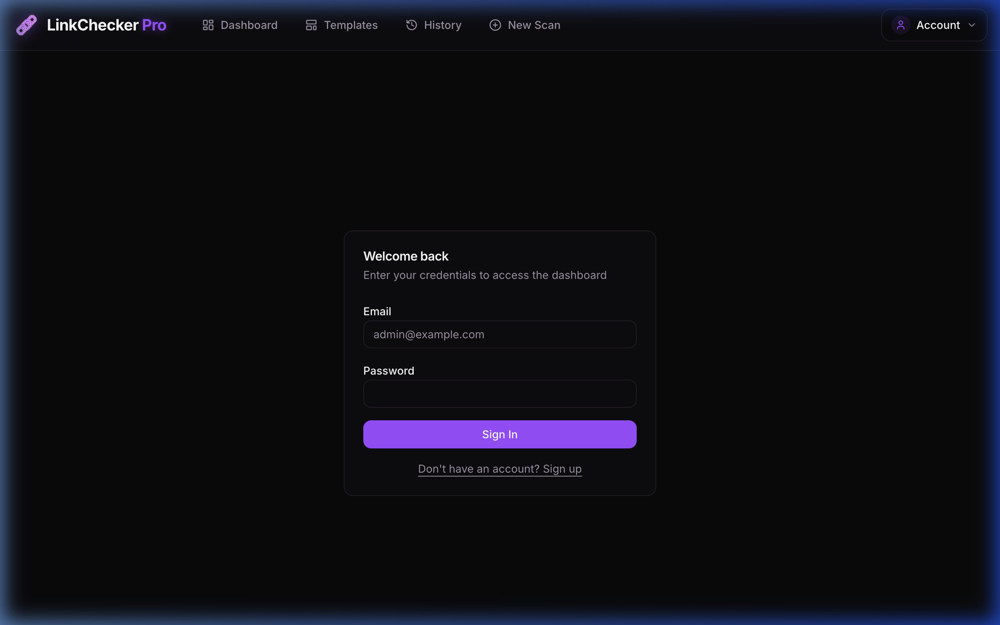

# 🔗 Lynx Scan



**Lynx Scan** is a high-performance, professional-grade digital integrity and link monitoring platform built for reliability and speed. Designed with a premium, multi-accented dark aesthetic, it provides deep recursive crawling, real-time progress monitoring, and advanced report triage.

## 🚀 Key Features

- **Blazing Fast Crawling**: Parallelized scanning engine designed for large-scale websites.
- **Deep Recursive Audits**: Analyzes every corner of your domain to find broken links, protocol errors, and redirect loops.
- **Targeted Monitoring**: Isolate specific assets (PDFs, landing pages, images) for high-precision audits without the noise of a full site crawl.
- **Multi-Accent Design System**: Modern, vibrant UI using Purple, Cyan, and Emerald for clear visual hierarchy and component differentiation.
- **Enterprise-Ready**: Support for custom user agents, advanced exclusion logic (regex), and subpath restriction.
- **Docker-Ready**: Optimized multi-stage builds for both the Next.js application and the background worker.

## 🛠 Tech Stack

- **Framework**: Next.js 15 (App Router)
- **Styling**: Tailwind CSS v4
- **Database**: PostgreSQL / Drizzle ORM
- **Queue System**: BullMQ / Redis
- **Icons**: Lucide React
- **Animations**: Framer Motion / Motion (client-side)

---

## 📦 Getting Started

You can run Lynx Scan in two ways:
- **Local Development**: Runs the App and Worker via `npm`, while keeping the Database and Redis in lightweight Docker containers.
- **Full Docker Stack**: Runs everything (App, Worker, DB, Redis, pgAdmin) inside Docker.

> [!IMPORTANT]
> **Port Conflict Warning**: You cannot run both modes at the same time. They share the same ports (3000, 5432, 6379). Always run `docker-compose down` before switching from the Full Stack to Local Development.

### Option 1: Full Docker Stack (Recommended for Deployment)
Run the entire application, worker, and database using a single command.

1. **Clone & Enter**:
   ```bash
   git clone https://github.com/your-username/lynx-scan.git
   cd lynx-scan
   ```

2. **Configure**:
   ```bash
   cp .env.example .env
   ```

3. **Launch**:
   ```bash
   docker-compose up -d
   ```
   *The app will be available at [http://localhost:3000](http://localhost:3000)*.

---

### Option 2: Local Development
Run the Next.js app locally while Docker handles the backend dependencies (DB, Redis).

1. **Install dependencies**:
   ```bash
   npm install
   ```

2. **Configure**:
   ```bash
   cp .env.example .env
   ```

3. **Launch**:
   ```bash
   npm run dev
   ```
   *(Note: This automatically starts the required DB and Redis containers via `docker/services/docker-compose.yml`.)*

---

## 🛠️ Management & Maintenance

### Administrative Setup
The **first user** to register on a new installation is automatically granted the **ADMIN** role. Subsequent users are marked as **PENDING** and must be approved by an administrator via the **Users** management dashboard.

### Resetting the System

**Soft Reset (Keep config, wipe data)**
To wipe all data (scans, users, templates, and backups) but leave your `.env` and Docker container settings intact:
```bash
npm run reset-all
```

**Hard Reset (Nuke Everything)**
To restart completely from zero (destroys `.env`, drops all databases, destroys all Docker volumes and caches):
```bash
npm run nuke
```

### Database Management
To browse all user databases, use **pgAdmin 4**, included in the stack:
- **URL**: `http://localhost:5050`
- **Default Credentials**: `admin@lynxscan.com` / `admin`

### Distributed Background Processing (BullMQ)
The application uses **BullMQ** with **Redis** to handle background link scanning.

- **Monitoring UI**: Visit `http://localhost:3001/admin/queues` to monitor job progress.
- **Scaling Workers**: If you have a large number of links, scale the worker service:
  ```bash
  docker-compose up -d --scale worker=4
  ```

---

## 🐳 Docker Image Management

To deploy Lynx Scan to a remote machine (like Proxmox or a VPS), you need to build the images, tag them with your Docker Hub username, and push them.

### 1. Build and Tag the Images
You can build and tag both images at once using Docker Compose. Replace `angilma1` with your actual Docker Hub username if it changes.

```bash
# Build and tag automatically using the names defined in docker-compose.yml
DOCKER_IMAGE_APP=angilma1/lynxscan DOCKER_IMAGE_WORKER=angilma1/lynxscan-worker docker-compose build
```

Alternatively, you can build and tag them manually:
```bash
# Build the main application
docker build -t angilma1/lynxscan .

# Build the background worker
docker build -t angilma1/lynxscan-worker -f docker/services/worker.Dockerfile .
```

### 2. Push to Docker Hub
1. **Login**:
   ```bash
   docker login
   ```
2. **Push**:
   ```bash
   docker push angilma1/lynxscan
   docker push angilma1/lynxscan-worker
   ```

### 3. Deploy on a Remote Machine
1. **Transfer** the `docker-compose.yml` and your `.env` file to the remote machine.
2. **Configure** the remote `docker-compose.yml` to use your images. You can do this by setting environment variables or editing the file:
   ```bash
   # On the remote machine
   export DOCKER_IMAGE_APP=angilma1/lynxscan
   export DOCKER_IMAGE_WORKER=angilma1/lynxscan-worker
   docker-compose pull
   docker-compose up -d
   ```
   *Note: If you don't want to use environment variables, simply comment out the `build:` sections in `docker-compose.yml` and set the `image:` fields directly to `angilma1/lynxscan`.*

---

## ⚠️ Docker Deployment Notes

When running the **Full Docker Stack** (`docker-compose.yml` in the root), please keep the following in mind:

- **Database Migrations**: The `app` container in the full stack is optimized for production and does not automatically push schema changes. If you modify the database schema, you may need to run `npm run dev` locally once to push the schema or use `drizzle-kit` manually.
- **Process Management**: Features that attempt to start or stop the Docker stack from within the UI (Admin settings) will not work when the app itself is running inside a container.
- **Environment Variables**: Ensure your `.env` file is properly configured before running `docker-compose up`. The `DATABASE_URL` and `REDIS_URL` in the compose file use internal service names (`db` and `redis`).

---

## 🧪 Testing

Lynx Scan uses **Vitest** for unit tests and **Playwright** for E2E tests.

- `npm run test`: Run unit and integration tests.
- `npm run test:e2e`: Run end-to-end tests with Playwright.

---

Developed with ❤️ for the world to use.
